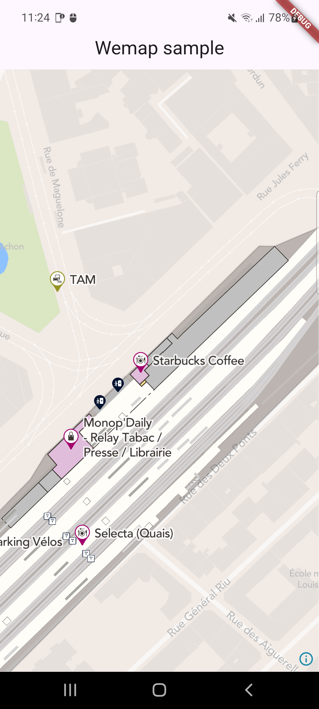

# Wemap SDK Flutter Sample

[](https://pbs.twimg.com/profile_images/1116734140177616896/Sby-gTyX_400x400.png)


Wemap SDK Flutter Sample

## Development

To develop Wemap software in this repository, ensure that you have at least the following software:

- [Flutter](https://docs.flutter.dev/get-started/install)

## Installation

* download repository
* Before starting running the application sample, you'll need to configure your credentials .

### Configure credentials

Wemap provides WemapSDKs via a private host and you will need to get `secret`, `access` keys and `region` to be able to access it.
For additional information [contact Wemap team](https://getwemap.com/contact).

Once you get the credentials, specify `AWS_ACCESS_KEY_ID`, `AWS_SECRET_ACCESS_KEY` and `AWS_REGION` in your environment

``` shell
export AWS_ACCESS_KEY_ID=...
export AWS_SECRET_ACCESS_KEY=...
export AWS_REGION=...
```

then you will send us your flutter team email, so you get permissions to use the SDK

### Add the dependency

firstly login with the same email you have provided us:

``` shell
dart pub global activate onepub
onepub login
```

* And then you can bootstrap dependencies using:
* `FVM` is provided if you want use same flutter version.

``` shell
flutter pub get
```

#### Android

* you can run the app on you android device

<p align="center">


</p>


#### iOS

* install necessary gems using Bundler and Gemfile or manually

  ``` shell
  bundle install
  ```

*  change to ios folder and install the pod

  ``` shell
  cd ios && pod install --repo-update
  ```

* you can run the app on you iOS device


<p align="center">


</p>
